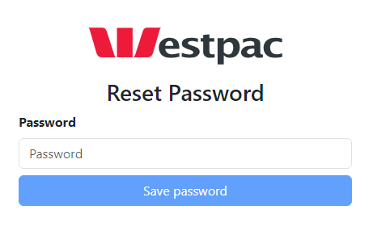
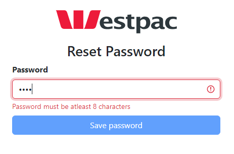
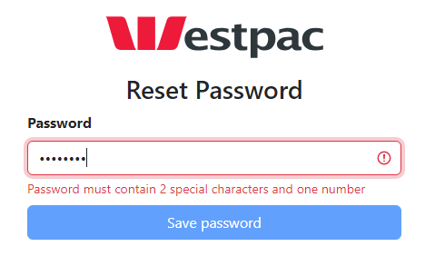
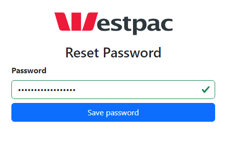

# Technical Assessment (Hrshikesh Arora)

This project implements a React single page application for a password reset functionality. It allows the user to enter their password, validates it against the requirements and then allows the user to save their new password if the validation passes and resets the page. Some screenshots of the application are shown below.

| Default application view | Invalid password (less than 8 chars) |
| --- | --- |
|  |  |

| Invalid password (missing special characters) | Valid password |
| --- | --- |
|  |  |

## Running the application

1. Clone this source repository into your chosen directory either by downloading this project as a zip or using the command below.

```
git clone https://github.com/arorahrsh/arorahr-tech-assessment.git
```

2. Change the current directory to be the cloned repository and install the project dependencies using `npm` (Note: if NodeJs aka npm is not installed, make sure this exists first).

```
cd arorahr-tech-assessment
npm install
```

3. Once the project dependencies are installed, run the application using the command below which will launch the app on a URL like `http://localhost:5173/` (please refer to the command line output for the correct URL).

```
npm run dev
```

### Running the units

4. Follow steps 1-2 above and then run the following command to execute the unit tests. Refer to the command line output for results.

```
```
