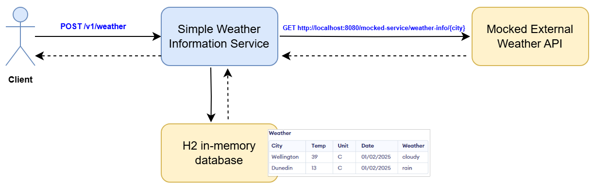
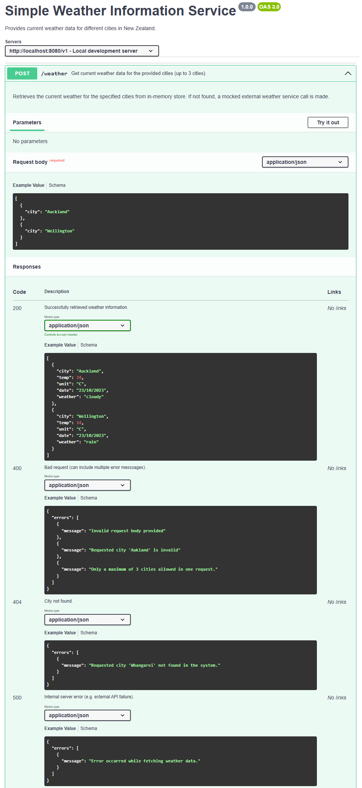

# Simple Weather Information Service

This project implements a REST API using Spring Boot to request weather data (upto 3 cities in any given request).

## Dependencies

* Java 17
* Gradle 8.5
* Spring Data JPA
* Spring Starter Web
* H2 (in-memory database)
* Lombok

## Running the application

1. Clone this source repository into your chosen directory either by downloading this project as a zip or using the command below.

```
git clone https://github.com/arorahrsh/arorahr-tech-assessment.git
```

2. Change the current directory to be the cloned repository and install the project dependencies using `gradle`

```
cd arorahr-tech-assessment
./gradlew build
```

3. Run the application using the command below which will deploy the app on `http://localhost:8080/`

```
./gradlew bootRun
```

4. Use CURL or a REST Client (e.g. Postman) to call this weather service API

```
curl -H 'Content-Type: application/json' -d '[{"city":"Auckland"},{"city":"Wellington"}]' -X POST http://localhost:8080/v1/weather
```

### Sample response

```json
[
  {
    "city": "Auckland",
    "temp": 30,
    "unit": "C",
    "date": "01/02/2025",
    "weather": "rain"
  },
  {
    "city": "Wellington",
    "temp": 39,
    "unit": "C",
    "date": "01/02/2025",
    "weather": "cloudy"
  }
]
```

### Sample logs

```
2025-02-01T23:17:16.841+13:00  INFO 11224 --- [nio-8080-exec-4] n.c.w.swis.controller.WeatherController  : Received POST /v1/weather request with JSON payload: [{"city":"Auckland"},{"city":"Wellington"}]
2025-02-01T23:17:16.841+13:00  INFO 11224 --- [nio-8080-exec-4] n.c.w.swis.service.WeatherServiceImpl    : Searching if cached weather data exists for city 'Auckland'
2025-02-01T23:17:16.842+13:00  INFO 11224 --- [nio-8080-exec-4] n.c.w.swis.service.WeatherServiceImpl    : Cached weather data not found in database for city 'Auckland'
2025-02-01T23:17:16.843+13:00  INFO 11224 --- [nio-8080-exec-4] n.c.w.swis.service.WeatherServiceImpl    : Requesting weather data from external mock service for city 'Auckland'
2025-02-01T23:17:16.863+13:00  INFO 11224 --- [nio-8080-exec-5] n.c.w.s.c.MockedWeatherInfoController    : Received GET /mocked-service/weather-info/Auckland
2025-02-01T23:17:16.864+13:00  INFO 11224 --- [nio-8080-exec-5] n.c.w.s.c.MockedWeatherInfoController    : Returning weather data from external API: {"city":"Auckland","temp":30,"unit":"C","date":"01/02/2025","weather":"rain"}
2025-02-01T23:17:16.868+13:00  INFO 11224 --- [nio-8080-exec-4] n.c.w.swis.service.WeatherServiceImpl    : Searching if cached weather data exists for city 'Wellington'
2025-02-01T23:17:16.873+13:00  INFO 11224 --- [nio-8080-exec-4] n.c.w.swis.service.WeatherServiceImpl    : Found cached weather data for city 'Wellington': {"city":"Wellington","temp":39,"unit":"C","date":"01/02/2025","weather":"cloudy"}
2025-02-01T23:17:16.873+13:00  INFO 11224 --- [nio-8080-exec-4] n.c.w.swis.controller.WeatherController  : Returning 200 HTTP status code and JSON response: [{"city":"Auckland","temp":30,"unit":"C","date":"01/02/2025","weather":"rain"},{"city":"Wellington","temp":39,"unit":"C","date":"01/02/2025","weather":"cloudy"}]
```

## High level architecture

TODO



## API Specification

The project contains an Open API specification for this service which was drafted prior to development. This can be viewed on the [Swagger editor](https://editor.swagger.io/). Alternatively, a screenshot of this specification is shown below. For the raw specification, please refer to the [api-spec.yaml](./api-spec.yaml) file in the root directory.



## Design considerations

TODO

## Assumptions

TODO