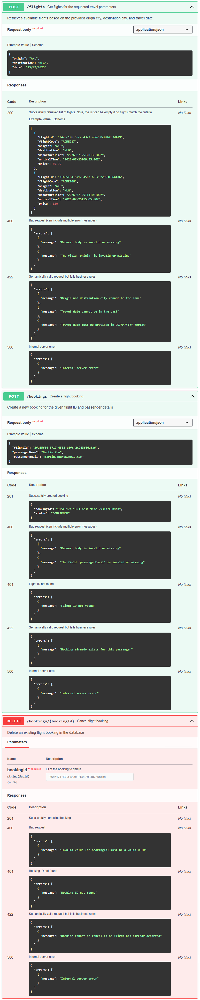

# ACME Air Flights Service

This project implements a REST API using Spring Boot to request flight information and manage bookings for ACME Air.

## Dependencies

* Java 21
* Gradle 8.5
* Spring Data JPA
* Spring Starter Web
* H2 (in-memory database)
* Lombok

## Running the application

1. Clone this source repository into your chosen directory either by downloading this project as a zip or using the command below.

```
git clone https://github.com/arorahrsh/arorahr-tech-assessment.git
```

2. Change the current directory to be the cloned repository and install the project dependencies using `gradle`

```
cd arorahr-tech-assessment
./gradlew build
```

3. Run the application using the command below which will deploy the app on: `http://localhost:8080/`

```
./gradlew bootRun
```

4. Use CURL or a REST Client (e.g. Postman) to call this flights service API

```
curl -X POST http://localhost:8080/v1/flights -H "Content-Type: application/json" -d '{"origin":"AKL","destination":"WLG","date":"2025-08-15"}'
```

## High level architecture

This project is designed as a REST API that contains three endpoints. These allow the client to request available flights, create and delete flight bookings. The application also contains 2 in-memory databases to store flights and bookings data.


## API Specification

The project contains an Open API specification for this service which was drafted prior to development. This can be viewed on the [Swagger editor](https://editor.swagger.io/). Alternatively, a shortened version of this specification is shown below. For the raw specification, please refer to the [api-spec.yaml](./api-spec.yaml) file in the root directory.



## Design considerations

- This API only supports one-way flights. However, clients can simulate a return trip by calling the `/v1/flights` and `/v1/bookings` endpoints twice. This design keeps the implementation simple while still supporting return trip bookings on the client side.
- While in the real world, a booking reference is in the form of a six character (e.g. `B9XXJU`), this solution represents the bookingId as a UUID (e.g. `52c1ed21-8375-4819-a562-7e59408cf35e`). This supports the scalability of this solution where the uniqueness of the 6 character booking reference could easily be exhausted.
- This service does not manage the responsibility of seat validation before booking a flight. It is assumed that if a flight is available in the database then it must have an available seat. This is by design to keep the core application simple and leave the seat logic to another microservice.
- The project is structured into readable and maintainable packages with the key layers being Controller, Repository and Service.
- Services are hidden behind an interface definition to allow future extensibility of the project.
- Global exception handling has been implemented using custom exceptions to return the correct HTTP status code (e.g. 400 or 404) and explicit error messages if the request fails.
- The H2 library and Spring JPA were used to implement an in-memory cache while the application is running to persist flight and bookings information. This could easily be replaced with an external database if required.
- A basic GitHub Actions pipeline was implemented to allow continuous build and test of the application. This pipeline runs on all branches including master.
- Verbose logging has been added as part of this API implementation. The default logging level is set to `INFO`.

## Assumptions

- Only supports domestic NZ airport origin and destinations limited to AKL, WLG, CHC, DUD, ZQN.
- All prices are in NZD currency.
- Different ticket classes (e.g. economy/business) are not supported in this MVP implementation.
- Does not support flexi fare tickets, meal or luggage selection. Assumes each flight comes with standard 23kg baggage and 7kg hand carry.
- No payment validation is completed as part of the booking step.
- Passenger is not allowed to book the same flight twice.
- Does not allow passenger to update their details (e.g. name or email). If they wish to update their booking, this can be done by cancelling the booking first and then rebooking the flight.
- No authentication or security checks (e.g. API keys or tokens) have been implemented as part of this API.

## Future enhancements

The following features were considered but not implemented in this initial implementation:

- Support for multiple ticket classes and fare types.
- Detailed flight information e.g. aircraft type, etc.
- Allow multiple seat bookings under a single passenger.
- Allow users to update bookings or transfer booking to another passenger.
- Integration of a loyalty points system when booking flights.
- Send email confirmation to passenger upon successful flight booking.
- Improve error messages to provide more detail (e.g. the exact issue with the request body).
- Containerize the application using a Dockerfile to allow deployment to a cloud platform.
- Fix an existing issue with Jackson deserialization which does not allow to chain error messages for multiple validation errors on enum types.