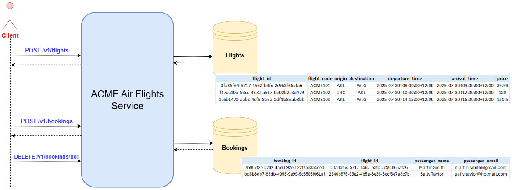

# ACME Air Flights Service

This project implements a REST API using Spring Boot to request flight information and manage bookings for ACME Air.

## Dependencies

* Java 21
* Gradle 8.5
* Spring Data JPA
* Spring Starter Web
* H2 (in-memory database)
* Lombok

## Running the application

1. Clone this source repository into your chosen directory either by downloading this project as a zip or using the command below.

```
git clone https://github.com/arorahrsh/arorahr-tech-assessment.git
```

2. Change the current directory to be the cloned repository and install the project dependencies using `gradle`

```
cd arorahr-tech-assessment
./gradlew build
```

3. Run the application using the command below which will deploy the app on: `http://localhost:8080/`

```
./gradlew bootRun
```

4. Use CURL or a REST Client (e.g. Postman) to call this flights service API

```
curl -X POST http://localhost:8080/v1/flights -H "Content-Type: application/json" -d '{"origin":"AKL","destination":"WLG","date":"2025-08-15"}'
```

### Sample logs

```

```

## High level architecture

This project is designed as a REST API that contains three endpoints. These allow the client to request available flights, create and delete flight bookings. The application also contains 2 in-memory databases to store flights and bookings data.



## API Specification

The project contains an Open API specification for this service which was drafted prior to development. This can be viewed on the [Swagger editor](https://editor.swagger.io/). Alternatively, a shortened version of this specification is shown below. For the raw specification, please refer to the [api-spec.yaml](./api-spec.yaml) file in the root directory.


## Design considerations

TODO

## Assumptions

TODO